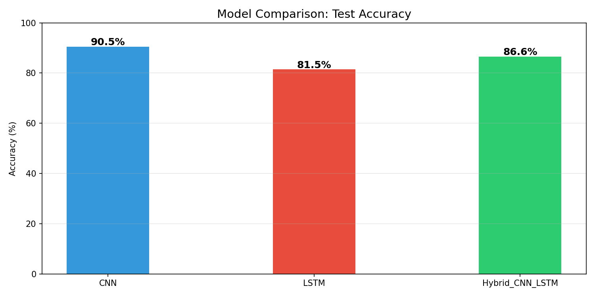
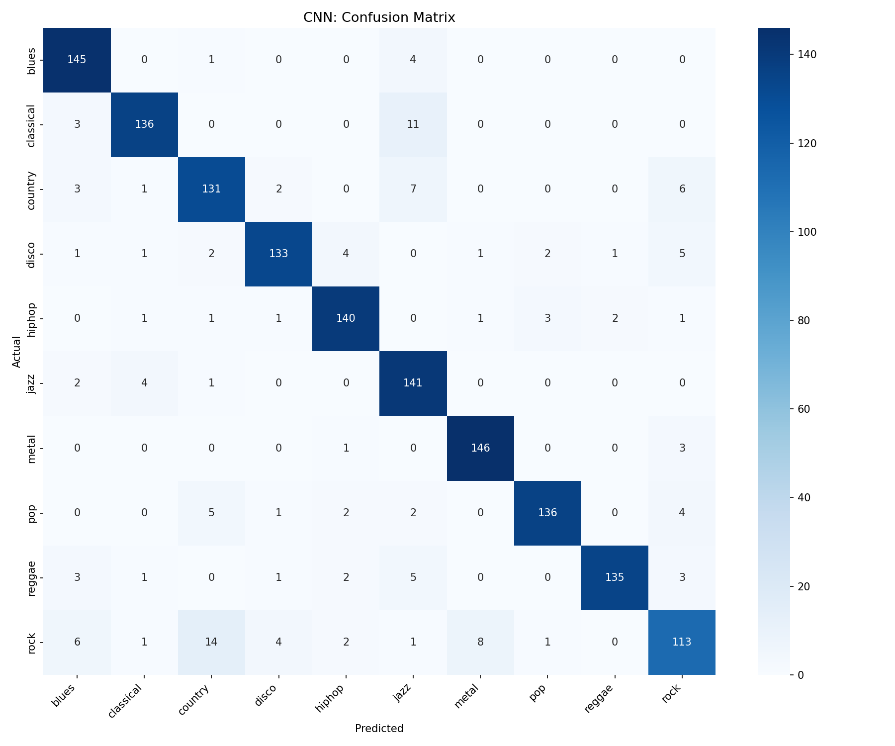
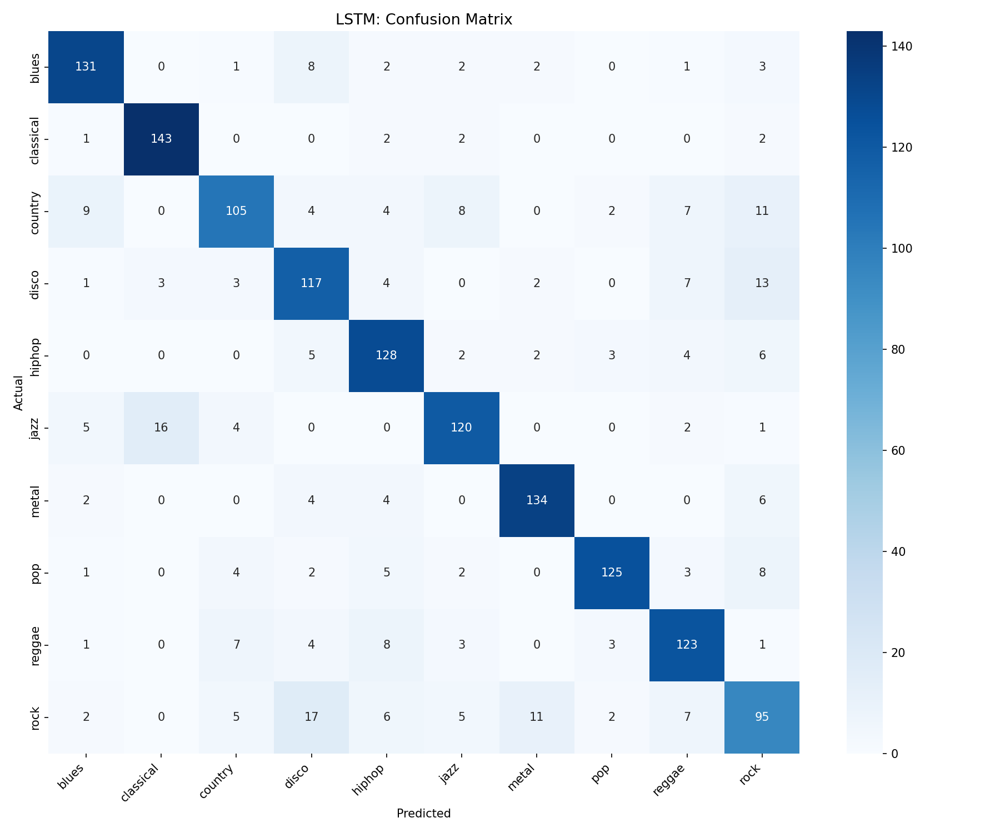
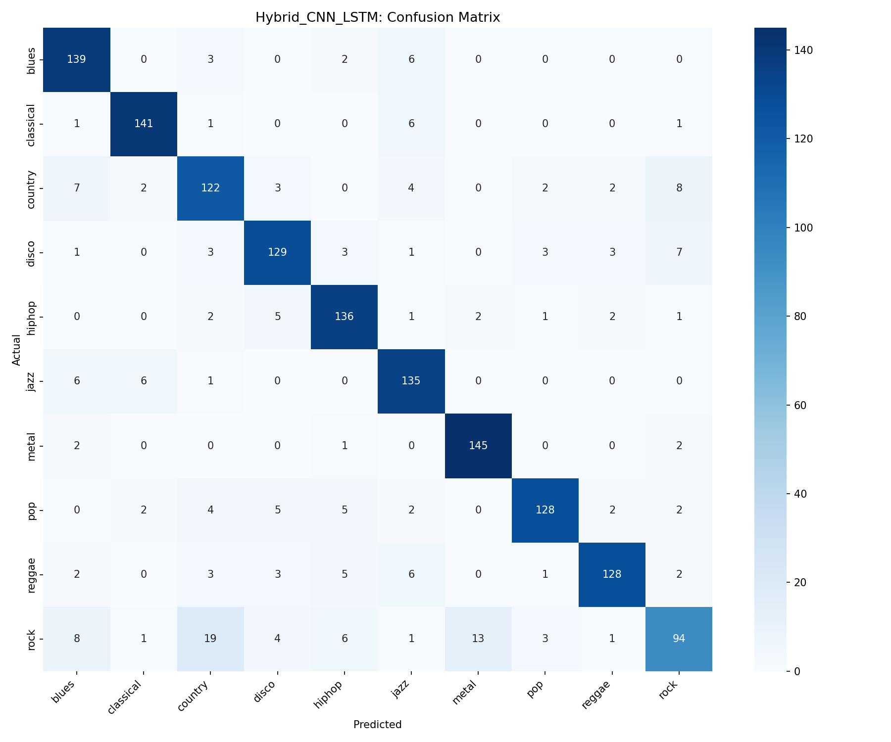

# 🎵 Music Genre Classification — Deep Learning (PyTorch)

Classifies music into 10 genres using three deep learning architectures trained from scratch on the GTZAN dataset.

## Problem Statement
Automatic music genre classification enables smarter music recommendation systems, streaming platform organization, and audio content tagging. This project compares CNN, LSTM, and hybrid CNN-LSTM architectures to identify the most effective deep learning approach for audio classification.

## Genres
Blues, Classical, Country, Disco, Hip-Hop, Jazz, Metal, Pop, Reggae, Rock

## Model Results

| Model | Test Accuracy |
|-------|--------------|
| CNN (Mel Spectrogram) | 90.52% |
| LSTM (MFCC Features) | 81.51% |
| **Hybrid CNN-LSTM** | **86.58%** |

CNN achieved the highest accuracy by effectively capturing spatial frequency patterns in mel spectrograms.

## Architecture

- **CNN** — 3 convolutional blocks on mel spectrograms for spatial feature extraction
- **LSTM** — 2-layer recurrent network on MFCC features for temporal pattern learning  
- **Hybrid CNN-LSTM** — CNN feature extractor feeding into LSTM for combined spatial + temporal modeling

## Results






## Dataset
GTZAN Dataset — 1000 audio clips, 10 genres, 30 seconds each  
Download: https://www.kaggle.com/datasets/andradaolteanu/gtzan-dataset-music-genre-classification  
Extract to: `data/genres_original/`

## How to Run
1. Clone the repository
```bash
git clone https://github.com/AndersonM3761/Music-genre-classifier.git
cd Music-genre-classifier
```
2. Install dependencies
```bash
pip install -r requirements.txt
```
3. Verify setup
```bash
python step1_setup_check.py
```
4. Download dataset
Download GTZAN from Kaggle:  
https://www.kaggle.com/datasets/andradaolteanu/gtzan-dataset-music-genre-classification
Extract so your folder looks like:
```
Data/genres_original/blues/
Data/genres_original/classical/
Data/genres_original/... (10 genre folders)
```
5. Preprocess audio
```bash
python step2_preprocess.py
```
6. Train models
```bash
python step3_train.py
```
Trains CNN, LSTM, and Hybrid CNN-LSTM. Saves best weights to `models/` and plots to `results/`.
7. Launch web app
```bash
streamlit run step4_demo_app.py
```
Project Structure
```
Music-genre-classifier/
├── models/
│   ├── CNN_best.pth
│   ├── LSTM_best.pth
│   └── Hybrid_CNN_LSTM_best.pth
├── results/
│   ├── CNN_confusion.png
│   ├── LSTM_confusion.png
│   ├── Hybrid_CNN_LSTM_confusion.png
│   ├── CNN_curves.png
│   ├── LSTM_curves.png
│   ├── Hybrid_CNN_LSTM_curves.png
│   ├── comparison.png
│   └── results.json
├── step1_setup_check.py       # Environment verification
├── step2_preprocess.py        # Feature extraction (MFCC + Mel Spectrogram)
├── step3_train.py             # Train all 3 models with comparison
├── step4_demo_app.py          # Streamlit web app
├── requirements.txt
└── README.md
```
Tech Stack
PyTorch — model training and inference
Librosa — audio feature extraction (MFCC, Mel Spectrogram)
Streamlit — interactive web application
Scikit-learn — evaluation metrics and confusion matrix
GTZAN — benchmark audio dataset